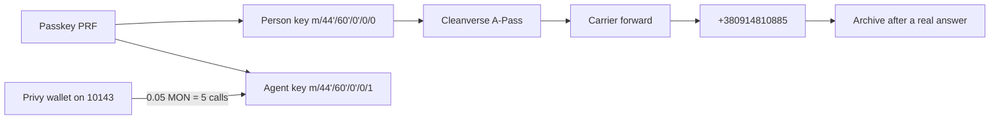

# Solarchik on Monad — architecture

Checked against the live app at https://solarchik-monad.vercel.app/ and Monad testnet chain id `10143`.

The judge path is the night booth. The home route renders that booth. `/judges` is the script for the demo. The yard, the roof run, and the work desk are still in the repo and are not the call path.

## 1. Account

`src/lib/passkey.ts`

- Create: `createPasskeyWithPrfOutput`. Return: `getPasskeyPrfOutput`.
- Relying party id is `location.hostname`. The passkey is useless on another host.
- PRF output → BIP-39 mnemonic → seed → two keys. Index `0` signs `Solarchik person`. Index `1` signs `Solarchik agent`. If a signature does not recover to that key, the account is refused.
- The two addresses must differ. The seed is not shown and is not stored. Only the credential id and transports go into `localStorage` key `solarchik-passkey`.
- A second module, `src/lib/mera-account.ts`, is an older single-key session. The booth does not use it.

## 2. Pass

`src/lib/cvi.ts`

- A server function calls `@usecordon/cleanverse` `queryChainConfig()` and keeps the row where `chain` is `monad` and `chain_id` is `10143`. The A-Pass address comes from that row. `getMagiclink().register_url` is the mint link, and only if it is `https`.
- The booth then calls `getAPassData(address)` on that contract through `https://testnet-rpc.monad.xyz`.
- Open means status word `0` is `1` and expiration word `5` is a unix time still in the future. Public A-Pass decoders use that same word order: status, tier, subTier, group, subGroup, expiration, then created-at. Do not treat word `6` as the expiration.
- Selector `0xfb524a44`, or any other revert, is a closed pass. The line stays off.
- A network failure returns "check again". It is not treated as open.
- The booth looks at the passkey address and, if a browser wallet was connected, at that wallet too. The first open pass wins. The browser wallet cannot pay.

On 9 Oct 2026 the live config named A-Pass proxy `0xbA82D189540CaC9DC6FF46B6837CaC1BFdEC58B9` (122 bytes, EIP-1967 implementation behind it). A read for an empty address reverted with `0xfb524a44`.

## 3. Payment

`src/components/secretary/BoothLive.tsx` and `src/components/secretary/privyMount.tsx`

- Privy is an embedded wallet on chain `10143`. Login method is email. It is not the account.
- Top up sends `0.05` MON to the agent key. The booth accepts the credit only after `eth_getTransactionByHash` shows that value arriving at the agent address. `0.05 / 0.01` is 5 calls.
- Send `0.01` MON is a one-call transfer, not the judge top-up.
- Spent calls live in `localStorage` key `solarchik-booth-credit`, next to the list of accepted hashes. Calls left = `floor(verified MON / 0.01) - spent`.
- The agent key's own MON balance is shown beside the address. That balance is not itself the call counter. Faucet MON sitting in Privy does not increase the counter until it is sent to the agent key.

## 4. Line and archive

The assistant number is `+380914810885` (`src/lib/game/secretary.ts`).

- Turn on checks the pass first. Closed, missing, or still loading: the carrier code is not dialed and the line is not claimed.
- The booth fills the carrier's forwarding code for the selected SIM country and hands it to the phone. The phone has to confirm. The app cannot forward the line by itself.
- Claiming the shared line asks the phone service to file the next call under this browser's player id. That claim does not spend MON.
- The player id is a random id in this browser (`solarchik-secretary-id`). It is not the passkey address.
- The booth asks the phone service for the inbox, the live call, and the transcript. A row is kept only after a real answer. Empty talk is not filled in.
- Pick up on a typed note is a separate screen of that note. It spends one call only when the pass is open and a call is left. Hang up stops speech. It does not refund the call.

The phone service in the deployed client is `https://solarchik-screen.davidbell1603.workers.dev`. The site and that worker are different deploys. The booth fails closed when a read fails: it says the archive did not open and shows the last list saved on the device.

Checked 9 Oct 2026, without arming the shared line:

| Request | Result |
|---|---|
| `GET /health` | 200 |
| `GET /block` | 200 |
| `POST /secretary-lang` | 200, English saved |
| `POST /call-claim` with a too-short id | 400, route present, line not armed |
| `GET /inbox`, `GET /balance`, `GET /call`, `GET /secretary-lang` | 500, Cloudflare 1101 |
| `GET /live` | 404 from the worker, so this route is not in the deployed script |

The web app still loads. A judge who opens the archive while those reads fail sees the booth's own "did not open" line, not a made-up call.

## 5. Earlier contracts

Deployed from `0x148c10bC74cC3cFb8F99d48DeA90cbF7897Cc2e1`. Bytecode was still present on 9 Oct 2026. They are not the booth payment.

| Contract | Address | Code |
|---|---|---|
| Streak | `0x357c1a631f208FBB84d430bd18FEE65B54456a38` | 790 bytes |
| Strategy | `0xDfdd6b3402180316D780d7634624d09b9026Fb42` | 10416 bytes |
| Suns | `0x060961d6495811582C886DB14B9F5cE6271fF3d6` | 2883 bytes |
| Agent | `0xb18cad14A950CD4cB7EEC936FE8843ef38eB6cDE` | 4027 bytes |

`/play` still opens the yard. Home does not. `src/lib/game/pay.ts` is an old Solana USDC helper. The booth does not call it.

## 6. What a judge should not expect

- The passkey from the founder's browser. A new browser starts at "No account yet."
- A pass on a brand-new passkey. Turn on stays blocked until a pass is open.
- Call credit from the faucet alone.
- An archive row before the assistant has answered.
- The old strategy NFT, streak, or suns as part of this demo.
